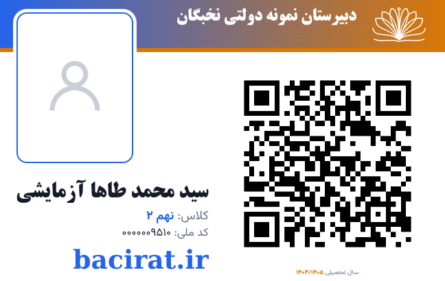

# لوگوی قبل از نام مدرسه، آپلودر و حذف دورخط کارت سفارشی

اصلاحیهٔ سایت **4.152.0** و دسکتاپ **2.83.0**، بدون تغییر نسخه — ۲۰۲۶-۰۹-۱۶.

## تغییرات

- لوگوی کارت سفارشی از وسط سربرگ به **سمت راستِ نام مدرسه** منتقل شد؛ ترتیب فارسی «لوگو، نام مدرسه» است. نام مدرسه فضای مستقل دارد و در صورت طولانی‌بودن کوچک می‌شود.
- کنار تنظیمات کارت سفارشی، **آپلود لوگو** و **بازگشت به لوگوی پیش‌فرض** اضافه شد. فقط لوگوی این شکل تغییر می‌کند؛ لوگوی عمومی مدرسه، عکس دانش‌آموزان و سه شکل دیگر دست‌نخورده‌اند. بدون لوگوی اختصاصی، لوگوی عمومی مدرسه و در نبود آن، همان نقش کتاب باز استفاده می‌شود.
- نوشتهٔ پایین مانند `bacirat.ir` از کادر واضح **«متن یا نشانی پایین کارت — تنظیم دستی»** ویرایش می‌شود. تغییر زنده در پیش‌نمایش و چاپ اعمال می‌شود؛ خالی‌کردن کادر نوشته را حذف می‌کند. متن در همان مرورگر ذخیره می‌شود، نه به‌عنوان تنظیم عمومی همهٔ کاربران.
- دورخط، سایه و خط‌چین برش و گوشه‌های شفاف اطراف کارت سفارشی حذف شدند؛ قاب بیرونی مستطیلی بدون تزئین اضافی است. این حذف برای روی و پشتِ حالت سفارشی اعمال می‌شود. **حاشیهٔ سفید داخل QR حذف نشده** چون برای تشخیص اسکن ضروری است. قاب عکس و فاصله/حاشیهٔ انتخابی کاغذ تغییر نکرده‌اند.
- اندازهٔ کارت، تعداد نسخه‌های متوالی، ترتیب روی/پشت، QR، فیلترها و اصلاحات امنیتی قبلی حفظ شده‌اند.



نمونهٔ بالا دادهٔ آزمایشی است، نه کارت یک دانش‌آموز واقعی.

## آپلود و نگهداری

- PNG، JPG یا WebP، حداکثر ۲ مگابایت؛ هر ضلع حداکثر ۴۰۹۶ پیکسل و مجموع حداکثر ۸ مگاپیکسل.
- نقش مجاز همان صفحهٔ کارت ورود است: مدیر دارای مجوز مدیریت دانش‌آموزان یا معاون. درخواست باید POST و CSRF معتبر داشته باشد؛ نشست لغوشده نیز پیش از handler رد می‌شود.
- تصویر در سرور با **GD** بازخوانی، با حفظ نسبت و شفافیت به حداکثر ضلع ۵۱۲ پیکسل کوچک و دوباره به PNG تبدیل می‌شود. بایت‌های اولیه، نام فایل کاربر و SVG/HTML ذخیره نمی‌شوند.
- خروجی در `uploads/card-logos/` با نام تصادفی ذخیره و نشانی آن در تنظیم `card_custom_logo` ثبت می‌شود. پوشهٔ uploads باید قابل نوشتن باشد؛ GD باید فعال باشد. در بستهٔ پایهٔ دسکتاپ، DLL و تنظیم فعال‌سازی GD موجود است؛ Windows عملیاتی کاربر در محیط آزمون در دسترس نبود.
- فایل قبلی در تعویض یا بازگشت به پیش‌فرض حذف نمی‌شود تا بازیابی ممکن بماند. خطای اعتبارسنجی یا ذخیره، لوگوی قبلی را عوض نمی‌کند. برای پشتیبان‌گیری، دیتابیس و uploads را با هم نگه دارید.
- لوگو برای همین نصب ذخیره می‌شود و پس از بازکردن صفحه در مرورگر دیگر هم خوانده می‌شود. اگر سایت و دسکتاپ نصب‌های مستقل‌اند، تنظیم هرکدام مستقل است؛ این وصله موتور همگام‌سازی را تغییر نمی‌دهد.

## نصب

پیش‌نیاز: نصب فعلی شامل بستهٔ قبلی **`custom-card`** و پیش‌نیازهایش. این بسته فقط اصلاحیهٔ افزایشی است.

1. از فایل‌ها و دیتابیس پشتیبان بگیرید؛ دسکتاپ را کامل ببندید یا سایت را موقتاً در حالت نگهداری قرار دهید.
2. سایت: محتویات `site-update-v4.152.0/` از `SITE-FIX-v4.152.0-custom-card-logo.zip` را با حفظ مسیرها در ریشهٔ سایت جایگزین کنید.
3. دسکتاپ: محتویات `SchoolDeskPro/www/` از `SchoolDeskPro-FIX-v2.83.0-custom-card-logo.zip` را روی نصب موجود کپی کنید؛ کل پوشهٔ www یا داده‌ها را حذف نکنید.
4. هر **۵ فایل** را منتقل کنید؛ در انتقال دستی helperها و JS را پیش از صفحه جایگزین کنید. اگر OPcache لازم دارد، آن را تازه‌سازی کنید.
5. صفحهٔ کارت ورود را با **Ctrl+F5** تازه کنید و **شکل کارت ← سفارشی** را انتخاب کنید. آپلودر و کادر متن کنار پیش‌نمایش ظاهر می‌شوند. قبل از چاپ، منتظر پیام موفقیت آپلود بمانید.
6. چاپ: همان کاغذ و جهت انتخابی، Scale=100%، یک صفحه در هر برگ و بدون سربرگ/پابرگ مرورگر. مقدار حاشیهٔ کاغذ انتخابی کاربر مستقل از حذف دورخط کارت است.

فهرست دقیق فایل‌ها:

```
entry-card-logo.php
entry-cards.php
includes/card_face.php
includes/card_custom_styles.php
assets/js/card-custom.js
```

هیچ عکس دانش‌آموز، دیتابیس، فونت، قالب Word، تنظیم اتصال یا فایل نسخه در ZIP نیست. بسته‌های قبلی دوباره ساخته نشده‌اند.

## آزمون‌ها

- ۲۹ سوئیت فعلی پروژه سبز؛ شامل API آپلود، مجوز، POST/CSRF، رد دادهٔ نامعتبر/SVG/حجم زیاد، بازنویسی PNG، محدودیت ابعاد، حفظ لوگوی قبلی در خطا، بازگردانی و رد نشست لغوشده.
- Chromium: انتخاب فایل واقعی از آپلودر تا PHP/GD، به‌روزرسانی نسخه‌های پیش‌نمایش، ذخیره و بازگردانی پس از تازه‌سازی، موقعیت لوگو قبل از نام، متن دستی در چاپ و نبود دورخط در روی/پشت سفارشی.
- رگرسیون سفارشی: سه مقیاس، جا شدن نام طولانی، QR رمزگشایی‌شده، کلیدهای عکس/کد ملی/سال و حفظ سه شکل قبلی.
- ۲۷ حالت مقایسهٔ پیش‌نمایش/چاپ/تعداد صفحات **PDF واقعی** گذشت؛ شامل چهار شکل، دو جهت A4 و سه مقیاس، و کنترل‌های A5/A3/A2.
- نه سوئیت بسته‌بندی: تطابق دقیق فایل‌های لازم با سورس و دست‌نخورده‌ماندن ZIPهای قبلی.

محیط بررسی PHP-WASM 8.3، SQLite و Chromium بود، نه MySQL عملیاتی، Windows کاربر یا چاپگر فیزیکی.

```sh
SITE=path/to/full/www PATCH=update-v4.152.0 node tests/test-card-logo.mjs
PRINT_BROWSER=1 SITE=path/to/full/www PATCH=update-v4.152.0 node tests/test-card-logo.mjs
python3 tests/test-card-logo-packaging.py
python3 scripts/release-card-logo.py
```

آزمون مرورگر از وابستگی‌های قبلی Playwright و `@sparticuz/chromium` در `BROWSER_MODULES` یا `.cache/browser/node_modules` استفاده می‌کند.

## SHA-256

- سایت، 21427 بایت: `fdc16cc4301a4d15a5f73e59e5a4625580c520578b6afe7233808f101d6180e7`
- دسکتاپ، 21397 بایت: `5d7acc857dde5d3d0fd2ba4723875013de65f66ad74720f1ed14833fe3606ef3`
