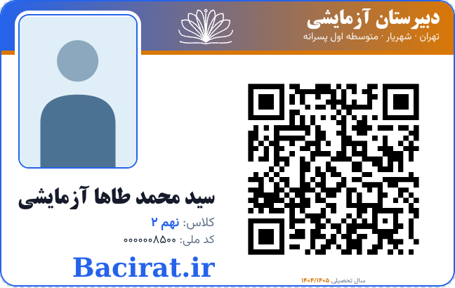

# شکل جدید کارت ورود: «سفارشی»

سایت **4.152.0** / دسکتاپ **2.83.0** — بدون افزایش نسخه؛ ۲۰۲۶-۰۹-۱۶.

این شکل از تصویر ارسالی کاربر بازسازی شده است؛ تصویر دانش‌آموز، نام و QR موجود در نمونه در برنامه جاسازی نشده‌اند.

## چیدمان

- گزینهٔ **«سفارشی»** به فهرست «شکل کارت» افزوده شد. کامل، تگ‌محور و مربع همچنان موجودند؛ پیش‌فرض نیز تغییر نکرده است.
- اندازهٔ استاندارد همان **۸۵٫۶ × ۵۴ میلی‌متر** است.
- عکس بزرگ‌تر، **۲۲٫۵ × ۲۹ میلی‌متر**، در بالا-چپ قرار دارد و از روی سربرگ عبور می‌کند؛ قاب گرد و حاشیهٔ سفید دارد. تصویر بدون کشیدگی با حفظ نسبت‌ها نمایش داده می‌شود؛ عکس با نسبت متفاوت ممکن است فضای سفید داشته باشد.
- سربرگ رنگی، نام و مشخصات مدرسه در راست و نشان در میانه دارد. در صورت وجود لوگوی مدرسه، همان لوگو نمایش داده می‌شود؛ در غیر این صورت نقش برداری کتاب باز قرار می‌گیرد.
- QR واقعی هر دانش‌آموز در سمت راست، با همان بوم **۴۰ میلی‌متری و حاشیهٔ امن اسکن** باقی می‌ماند؛ بریده یا کشیده نمی‌شود.
- نام درشت زیر عکس، سپس کلاس و کد ملی قرار می‌گیرند. نام طولانی فقط به اندازهٔ لازم کوچک می‌شود؛ فاصلهٔ مصنوعی، کشیدگی افقی و جایگزینی با نام نمونه نداریم.
- نوشتهٔ بزرگ آبی پایین-چپ، مطابق نمونه `Bacirat.ir` است؛ اگر تنظیم `school_website` وجود داشته باشد از آن شروع می‌شود. در کادر **«نوشتهٔ پایین کارت سفارشی»** می‌توان متن را تغییر داد یا با خالی‌کردن حذف کرد. متن حداکثر ۸۰ کاراکتر، صرفاً متن نمایشی است و QR را تغییر نمی‌دهد.
- ردیف تکراری پایه و عنوان زیر QR در این شکل پنهان‌اند. عکس، کد ملی و سال همچنان کلید نمایش/عدم نمایش دارند؛ سال در لبهٔ پایین سمت راست، جدا از حاشیهٔ امن QR قرار می‌گیرد.
- پشت کارت تغییر نکرده است. تعداد نسخه‌های متوالی ۱ تا ۱۰، ترتیب روی/پشت، فیلترها و تنظیمات کاغذ حفظ شدند.
- بریدگی‌های سفید و اعوجاج ناشی از مونتاژ عکس مرجع، به‌عنوان عنصر طراحی وارد نشده‌اند.



تصویر بالا **آزمایشی** است؛ اطلاعات و تصویر یک دانش‌آموز واقعی را نشان نمی‌دهد.

## نصب و استفاده

پیش‌نیاز: نصب فعلی به‌همراه اصلاحیهٔ قبلی **`security-print`**. بستهٔ حاضر افزایشی است، نه نسخهٔ کامل/تجمیعی.

1. از فایل‌های برنامه پشتیبان بگیرید. هنگام نصب، دسکتاپ را کامل ببندید یا سایت را موقتاً در حالت نگهداری قرار دهید.
2. سایت: محتویات `site-update-v4.152.0/` از `SITE-FIX-v4.152.0-custom-card.zip` را در ریشهٔ سایت با حفظ مسیرها جایگزین کنید.
3. دسکتاپ: محتویات `SchoolDeskPro/www/` از `SchoolDeskPro-FIX-v2.83.0-custom-card.zip` را روی نصب موجود کپی کنید؛ کل پوشهٔ `www` یا داده‌ها را حذف نکنید.
4. هر **چهار فایل** را منتقل کنید؛ helperها و فایل جاوااسکریپت را پیش از صفحهٔ PHP جایگزین کنید. در صورت نیاز، OPcache هاست را تازه‌سازی کنید.
5. صفحهٔ کارت ورود را با Ctrl+F5 تازه‌سازی کنید و از **شکل کارت ← سفارشی** استفاده کنید. تنظیمات طرح و نوشته در همان مرورگر ذخیره می‌شوند؛ چاپ نیز همین مقادیر را دریافت می‌کند.
6. برای خروجی مشابه پیش‌نمایش، در چاپگر همان کاغذ/جهت انتخابی، **Scale=100% و یک صفحه در هر برگ** را انتخاب و سربرگ/پابرگ مرورگر را غیرفعال کنید. بزرگ‌نمایی کارت را در خود طراح تنظیم کنید.

فهرست دقیق ZIP:

```
entry-cards.php
includes/card_face.php
includes/card_custom_styles.php
assets/js/card-custom.js
```

هیچ دیتابیس، عکس دانش‌آموز، فونت جدید، قالب Word، تنظیم اتصال، فایل امنیت نشست یا فایل تغییر نسخه در بسته نیست. طرح‌های قدیمی و اصلاحیه‌های پیشین دوباره بسته‌بندی نشده‌اند.

## بررسی‌ها

- ۲۸ سوئیت فعلی پروژه سبز؛ اعتبارسنجی پارامتر، متن خالی/بلند/HTML، انتخاب شکل و یکسان‌ماندن دادهٔ QR نیز بررسی شد.
- Chromium: تطابق جای عناصر داخلی میان چاپ و پیش‌نمایش در مقیاس‌های ۶۰، ۱۰۰ و ۱۶۰ درصد؛ عدم تداخل عکس، نام و QR؛ جا شدن نام طولانی؛ تشخیص واقعی QR روی همهٔ نسخه‌ها؛ تعداد صفحات فیزیکی PDF A4.
- ذخیرهٔ گزینهٔ سفارشی/متن، کلیدهای عکس/کد ملی/سال و بازگشت هندسه و فونت به سه شکل قبلی بررسی شدند.
- ۲۷ حالت آزمون عمومی چاپ/پیش‌نمایش/PDF گذشت: چهار شکل در دو جهت A4 و سه مقیاس، به‌علاوهٔ سه کنترل A5/A3/A2.
- هشت سوئیت بسته‌بندی، شامل تطابق دقیق چهار فایل هر ZIP با سورس و دست‌نخورده‌ماندن بسته‌های قبلی.

محیط آزمون PHP-WASM 8.3، SQLite و Chromium بود؛ چاپگر فیزیکی، Windows کاربر و دیتابیس عملیاتی او در دسترس نبودند.

```sh
SITE=path/to/full/www PATCH=update-v4.152.0 node tests/test-custom-card.mjs
PRINT_BROWSER=1 SITE=path/to/full/www PATCH=update-v4.152.0 node tests/test-custom-card.mjs
PRINT_BROWSER=1 SITE=path/to/full/www PATCH=update-v4.152.0 node tests/test-card-print-layout.mjs
python3 tests/test-custom-card-packaging.py
python3 scripts/release-custom-card.py
```

برای آزمون مرورگری، Playwright، `@sparticuz/chromium` و `pdf-lib` در مسیر `BROWSER_MODULES` یا `.cache/browser/node_modules` لازم‌اند.

## SHA-256

- سایت، ۱۷٬۶۸۲ بایت: `ff6e228e4c586a83248b907f97e95ef3b3db0aced55a26074bf03dc16e87e8c6`
- دسکتاپ، ۱۷٬۶۵۸ بایت: `b1bd50241c178a5262d3a6da0c6fe6c13d8685fec4903b85c7b57f5e41d2b3c3`
